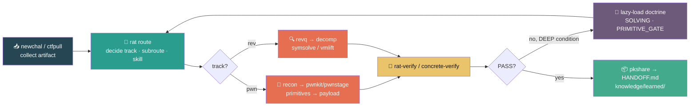

<a id="readme-top"></a>

<div align="center">


<br>

# CTF-Rat

### **route → verify → reuse**

Verify fast on a small context, and stop re-deriving what the cache already knows.

<p>


</p>

<p>


</p>

</div>

<br>

A pwn/rev-focused, **environment-agnostic, self-contained CTF solving kit.** Tools, doctrine,
knowledge, and reference data all live in one repo — set it up **once** on any Linux environment
(native / VM / WSL2 / container) and Claude · Codex can start solving challenges right here.

<details open>
<summary><b>📑 Table of Contents</b></summary>

- [⚡ Quick Start](#-quick-start)
- [🔄 Flow](#-flow)
- [🧭 Entry Points & Rules](#-entry-points--rules)
- [📂 Layout](#-layout)
- [🛠️ Core Tools](#️-core-tools)
- [✅ Tests](#-tests-after-modifying-tools)
- [📐 Operating Principles](#-operating-principles)

</details>

## ⚡ Quick Start

```sh
# 0. One-time environment setup (venv+angr+pwntools, Ghidra, glibc-fetch)  →  SETUP.md
# 1. Lock the target engagement (allowlist / active lock)
ctfguard begin <challenge> [target]
# 2. Route — decide track/subroute/skill (thin composition, no new analysis)
rat route <bin>
# 3. Detailed triage
revq <bin>        # rev
recon <bin>       # pwn
```

<div align="right"><a href="#readme-top">↑ back to top</a></div>

## 🔄 Flow



<div align="right"><a href="#readme-top">↑ back to top</a></div>

## 🧭 Entry Points & Rules

| Doc                                                              | Role                                                                                                                                                                 |
| ---------------------------------------------------------------- | -------------------------------------------------------------------------------------------------------------------------------------------------------------------- |
| **[SETUP.md](SETUP.md)**                                         | Environment-agnostic one-time setup                                                                                                                                  |
| **[CLAUDE.md](CLAUDE.md)** (= `AGENTS.md`)                       | Agent entry point. Auto-loads the FAST hot-path (7-rule ROE · tool map) every session; full doctrine is lazy-loaded **only on DEEP escalation** (M1 slim entrypoint) |
| **operator skill**                                               | `skills/<route>/SKILL.md` — load exactly **one** per route. SIGNALS / FIRST ACTION / PIVOT / ESCALATE / VERIFY                                                       |
| **[knowledge/GROUNDING_INDEX.md](knowledge/GROUNDING_INDEX.md)** | Knowledge router → `knowledge/ctf-skills/`                                                                                                                           |

> [!NOTE]
> **DEEP-only doctrine** — [SOLVING](doctrine/SOLVING.md) (ROE+6-phase) · [SOLVABILITY](doctrine/SOLVABILITY.md) · [PRIMITIVE_GATE](doctrine/PRIMITIVE_GATE.md) · [FINALS](doctrine/FINALS.md)
>
> Benchmark corpus, ablations, and design-review docs live on the `dev` branch. `main` ships only the operational tools needed to actually solve and verify challenges.

<div align="right"><a href="#readme-top">↑ back to top</a></div>

## 📂 Layout

```
CLAUDE.md / AGENTS.md      agent entry point (symlink)
SETUP.md                   environment-agnostic initial setup
doctrine/                  SOLVING · SOLVABILITY · PRIMITIVE_GATE · REFUSAL · FINALS
docs/                       calibration (오염 상수 포함 — doctrine 밖)
knowledge/                 vendored pwn/rev knowledge + repo-owned learned/ + writeup pipeline
reference/                 libc-offsets/ · glibc/(list · SOURCES · glibc-fetch)
bin/                       all tools (+ghidra_scripts/)
solve/_template/rev/       symsolve · vmlift
kernel/                    kernel pwn extensions
tests/                     e2e_mock.py(ctfpull) · e2e_rev.sh(rev loop)
```

<div align="right"><a href="#readme-top">↑ back to top</a></div>

## 🛠️ Core Tools

<details open>
<summary><code>rat</code> — the single front-door dispatcher</summary>
<br>

`rat route <bin>` decides track/subroute/skill (a thin composition of rat-doctor + rat-profile + revq,
no new analysis), and `rat query {func,oracle,slice}` · `rat dyn|verify` · `rat state compact` ·
`rat cache stats` expose everything through one entry point. Existing CLIs (revq / recon / etc.)
still work standalone.

</details>

<details>
<summary><code>ctfpull</code> — pull CTFd challenges into a <code>newchal</code> scaffold</summary>
<br>

Never auto-submits flags (ToS + honest-mode).

```sh
ctfpull ctfd --list [--category pwn]
ctfpull ctfd --id 42 [--dest DIR]        # download → extract → detect ELF → run.json → newchal
```

Config precedence: CLI > env vars (`CTFD_URL` / `CTFD_TOKEN`) > dotenv (`--env`, default `./.ctfd.env`).

</details>

<details open>
<summary>🔍 <b>rev loop</b></summary>
<br>

```sh
revq <bin>                     # summary + INTERESTING (check-routine candidates) + EVASION (anti-debug/packing)
revq <bin> --func <name>       # single-function neighborhood card (saves context before decompiling)
decomp <func>                  # Ghidra headless decompile cache
symsolve.py <bin> --find-str Correct --stdin 16 --printable   # recover input, re-run the real binary to verify
vmlift.py --disasm|--run|--solve [blob]                       # custom VM lifter
```

> [!TIP]
> `revq` addresses = angr's load base (PIE `0x400000`) → feed them straight into `symsolve --find <addr>`.

</details>

<details>
<summary>🎯 <b>pwn</b></summary>
<br>

`pwnkit` / `pwnstage` / `primitives` · `pwncalc` / `pwnleak` / `pwnpayload` / `pwnropcheck` / `pwncrash` / `pwnscope`

</details>

<details>
<summary>➕ <b>and more</b></summary>
<br>

- **Environment / execution plan** — `rat-doctor <bin> --format json` shows which paths (native/GDB/angr/Ghidra/QEMU/Qiling/Wine) actually work for this artifact and why others are blocked. Regression testing is handled separately by `pkselftest`.
- **Reproducible scenarios** — `rat-scenario init|validate|show` normalizes the input/argv/env/oracle shared by `rat-dyn` / `rat-runtime` / `rat-verify`. Binary stdin is preserved via `--stdin-file`.
- **State bus** — `state` (record confirmed / ruled-out / next) · **kernel** — `k_*` (kernel/).
- **Handoff & knowledge** — `pkshare` → `HANDOFF.md`; `writeupcheck` quality gate → reviewed lessons land in `knowledge/learned/`. Typed STATE v2 takes precedence; legacy PASS entries are shown only as candidates. Completion docs require an operator attestation linked to an evidence digest.

</details>

<div align="right"><a href="#readme-top">↑ back to top</a></div>

## ✅ Tests (after modifying tools)

```sh
python3 bin/revq selftest
python3 bin/rat selftest
python3 solve/_template/rev/symsolve.py selftest
python3 solve/_template/rev/vmlift.py selftest
python3 bin/ctfpull selftest && python3 tests/e2e_mock.py
python3 -m unittest tests.test_writeup_pipeline
bash tests/e2e_rev.sh        # real crackme e2e if angr is installed, selftest only otherwise
```

Passing means `ALL GREEN ✅` across the board.

<div align="right"><a href="#readme-top">↑ back to top</a></div>

## 📐 Operating Principles

> [!IMPORTANT]
> One active challenge at a time · fan-out only **inside** a challenge · delegate large reads to a subagent and pull back **conclusions only** · typed `.rat/events/STATE.v2.jsonl` is the canonical state stream (`STATE.jsonl` is legacy inspection/import only) · **no reinventing** what an existing tool already does.

<div align="right"><a href="#readme-top">↑ back to top</a></div>

<div align="center">

---

Made for the CTF grind · <b>route → verify → reuse</b>

</div>
