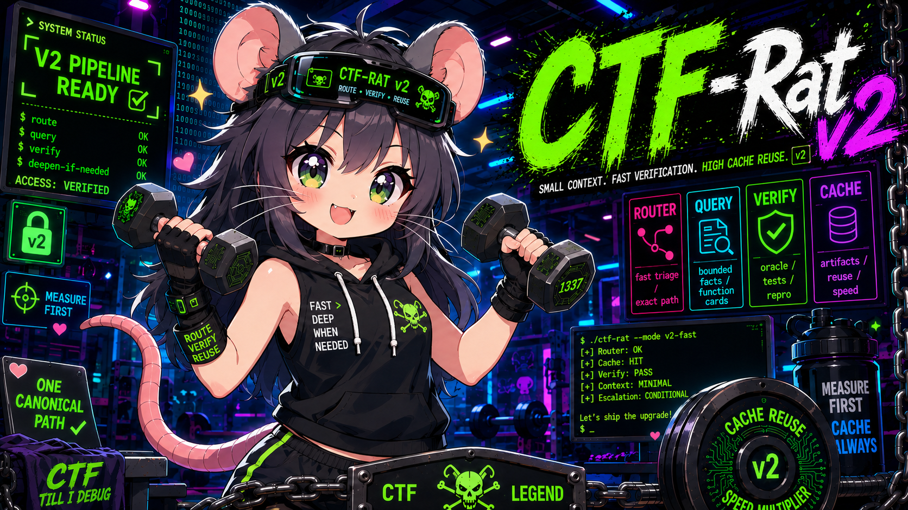

# ctf-rat — CTF(pwn/rev) 풀이 kit



pwn/rev 집중형 **환경 무관 self-contained CTF 풀이 kit.** 도구 + doctrine + 지식 + 참조데이터가
한 레포에 들어 있어, 어느 Linux 환경(네이티브/VM/WSL2/컨테이너)에든 한 번 세팅하면
Claude·Codex 가 이 레포에서 바로 문제를 푼다.

- **세팅**: [SETUP.md](SETUP.md) (venv+angr+pwntools, Ghidra, glibc-fetch — 한 번)
- **에이전트 진입점/규칙**: [CLAUDE.md](CLAUDE.md) (= `AGENTS.md`, Codex 호환). FAST hot-path(7-rule ROE·도구맵)를
  매 세션 자동 로드하고, doctrine 전문은 DEEP 승격 조건 충족 시 또는 명시 요청 시에만 지연 로드한다(M1 slim entrypoint).
  실제 CTF 교전은 먼저 `ctfguard begin <challenge> [target]`으로 대상 allowlist/active lock을 만든다.
- **풀이 doctrine(DEEP 전용)**: [doctrine/SOLVING.md](doctrine/SOLVING.md)(ROE+6-phase) · [doctrine/SOLVABILITY.md](doctrine/SOLVABILITY.md) · [doctrine/PRIMITIVE_GATE.md](doctrine/PRIMITIVE_GATE.md) · [doctrine/FINALS.md](doctrine/FINALS.md)
- **operator skill (FAST, route당 1개)**: `skills/<route>/SKILL.md` — SIGNALS/FIRST ACTION/PIVOT/ESCALATE/VERIFY.
- **지식**: [knowledge/GROUNDING_INDEX.md](knowledge/GROUNDING_INDEX.md) → `knowledge/ctf-skills/`
- benchmark corpus, ablation, 설계 검토 문서는 `dev` 브랜치에서 관리한다. `main`은 실제 풀이와 검증에 필요한 운영 도구만 제공한다.

## 레이아웃
```
CLAUDE.md / AGENTS.md      에이전트 진입점 (심볼릭)
SETUP.md                   환경무관 초기 세팅
doctrine/                  SOLVING · SOLVABILITY · calibration · FINALS
knowledge/                 vendored pwn/rev 지식 + repo-owned learned/ + writeup 절차
reference/                 libc-offsets/ · glibc/(list·SOURCES·glibc-fetch)
bin/                       도구 전체 (+ghidra_scripts/)
solve/_template/rev/       symsolve · vmlift
kernel/                    커널 pwn 확장
tests/                     e2e_mock.py(ctfpull) · e2e_rev.sh(rev 루프)
```

## 핵심 도구
- **`rat`** — 단일 front-door 디스패처. `rat route <bin>`로 track/subroute/skill을 판정하고
  (rat-doctor+rat-profile+revq를 얇게 조합, 새 분석 없음), `rat query {func,oracle,slice}` ·
  `rat dyn|verify` · `rat state compact` · `rat cache stats`를 한 진입점으로 노출한다.
  기존 CLI(revq/recon 등)는 그대로 독립 동작한다.
- **`ctfpull`** — CTFd 문제 수집 → `newchal` 스캐폴드. flag 자동제출 안 함(ToS+honest-mode).
  ```sh
  ctfpull ctfd --list [--category pwn]
  ctfpull ctfd --id 42 [--dest DIR]        # 다운로드→해제→ELF판별→run.json→newchal
  ```
  설정: CLI > 환경변수(`CTFD_URL`/`CTFD_TOKEN`) > dotenv(`--env`, 기본 `./.ctfd.env`).
- **`recon <bin>`** — pwn 정적 프로파일 + 보수적 triage.
- **환경/실행 계획**: `rat-doctor <bin> --format json`으로 현재 artifact에 실제 사용 가능한
  native/GDB/angr/Ghidra/QEMU/Qiling/Wine 경로와 차단 원인을 먼저 확인한다. 회귀검증은
  별도로 `pkselftest`가 담당한다.
- **재현 scenario**: `rat-scenario init|validate|show`로 `rat-dyn`/`rat-runtime`/`rat-verify`가
  공유하는 입력·argv·env·oracle을 정규화한다. binary stdin은 `--stdin-file`로 보존한다.
- **rev 루프** — `revq`(정적 배치: 함수/문자열/xref/interesting/**evasion**) → `decomp`(Ghidra) →
  `symsolve.py`(angr 하니스 + **concrete-verify**) → 커스텀 VM 은 `vmlift.py`.
  ```sh
  revq <bin>                     # 요약 + INTERESTING(check-루틴 후보) + EVASION(anti-debug/packing)
  revq <bin> --func <name>       # 한 함수 이웃 카드(디컴파일 전 컨텍스트 절약)
  symsolve.py <bin> --find-str Correct --stdin 16 --printable   # 복원 후 실 바이너리 재실행 검증
  vmlift.py --disasm|--run|--solve [blob]
  ```
  revq 주소 = angr 로드베이스(PIE 0x400000) → `symsolve --find <주소>` 그대로 투입.
- **pwn**: `pwnkit`/`pwnstage`/`primitives` · `pwncalc`/`pwnleak`/`pwnpayload`/`pwnropcheck`/`pwncrash`/`pwnscope`.
- **버스**: `state`(확정/배제/다음 기록) · **커널**: `k_*`(kernel/).
- **인계·지식화**: `pkshare` → `HANDOFF.md`, `writeupcheck` 품질 검사 → 검토된 교훈은 `knowledge/learned/`.
  typed STATE v2가 우선하며 legacy PASS는 candidate로만 표시한다. 완료 문서는 증거 digest가 연결된 operator attestation이 필요하다.

## 테스트 (도구 수정 후 회귀검증)
```sh
python3 bin/revq selftest
python3 bin/rat selftest
python3 solve/_template/rev/symsolve.py selftest
python3 solve/_template/rev/vmlift.py selftest
python3 bin/ctfpull selftest && python3 tests/e2e_mock.py
python3 -m unittest tests.test_writeup_pipeline
bash tests/e2e_rev.sh        # angr 있으면 실 crackme e2e, 없으면 selftest 만
```
전부 `ALL GREEN ✅`이면 통과.

## 운영 원칙
한 번에 활성 문제 1개 · 팬아웃은 문제 "안"에서만 · 큰 읽기는 서브에이전트로 위임하고 결론만 회수 ·
STATE.jsonl 단일 진실원 · 재발명 금지(기존 도구 재사용).
